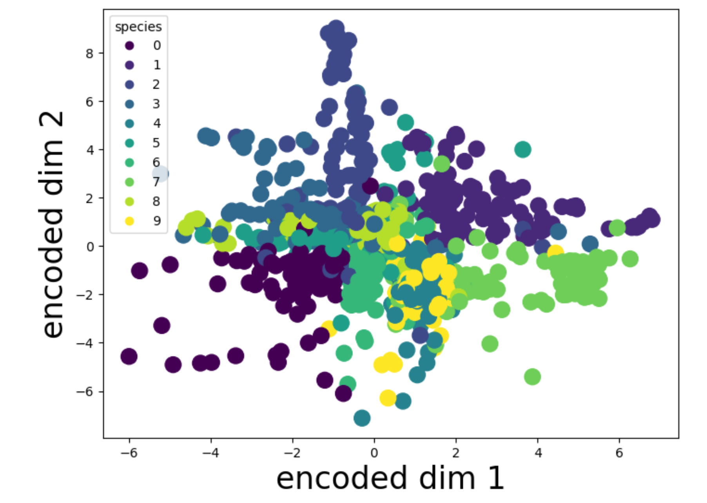
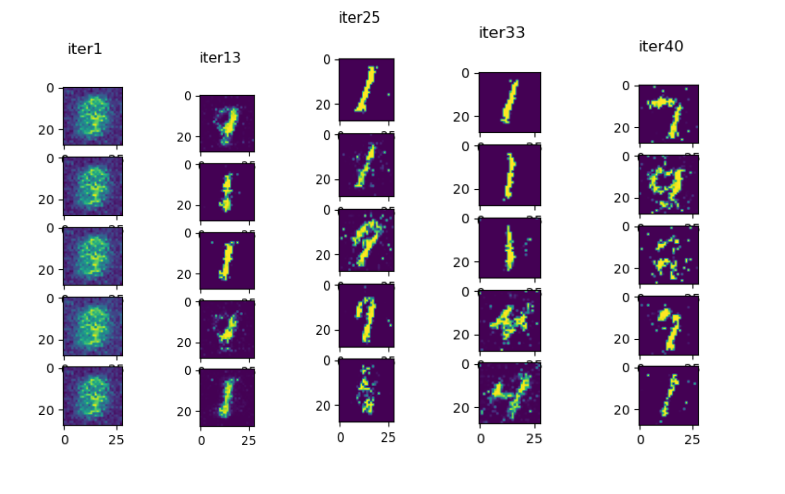
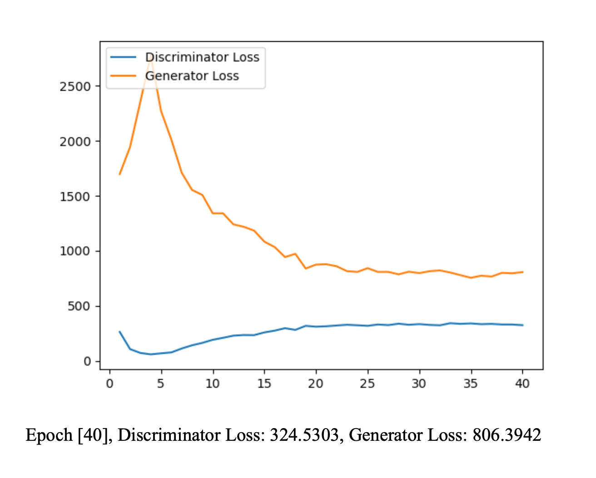

# ML-Practice

This depository contains some of the ML models from scratch with pytorch

- Cross Validation
- Ridge Regression
- Autoencoder
- Convolutional neural network
- Latent Dirichlet allocation (LDA)
- Generative Adversarial Network
- Multi-layer Perceptron
- Decision Tree
- Discriminator

## Results

### 2-D dateautoencoder
x-axis: encoded dimension 1 \\
y-axis: encoded dimension 2 \\
color: Class of the mapped data \\

### GAN

